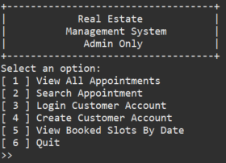
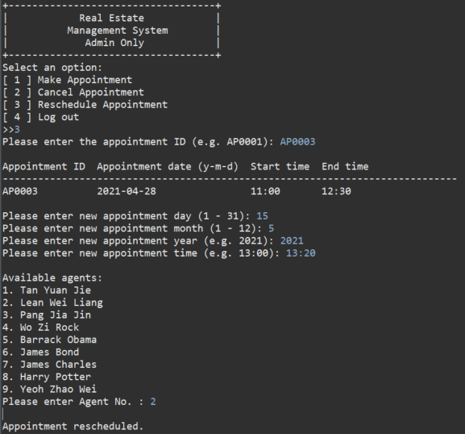

# RealEstateAppointmentManagementSystem
<!-- ALL-CONTRIBUTORS-BADGE:START - Do not remove or modify this section -->

<!-- ALL-CONTRIBUTORS-BADGE:END -->
<!-- ALL-CONTRIBUTORS-BADGE:START - Do not remove or modify this section -->

<!-- ALL-CONTRIBUTORS-BADGE:END -->

## Overview

This is a real estate appointment management system developed using Java. The objective of the assignments is to allow reinforce learning in analysing the issues of the requirements, design, and implementation of the reservation system. Furthermore, high-level and low-level designs of the system are created.

FYI, this system is designed using OOP approach and DAO design pattern.

The functions of the system are as follows:

1. Login Clerk and Customer Account
2. View Appointments
3. Search for Appointment
4. Create New Customer account
5. View Booked Slots
6. Make Appointment
7. Reschedule Appointment
8. Cancel Appointment

#### System Assumptions
1.	The customer is a stakeholder and will not be using the system.
2.	The clerk is the direct user of the system.
3.	The clerk will have to log in to the admin account before accessing the system.
4.	Customer can only perform make an appointment, cancel an appointment and reschedule an appointment through a clerk.
5.	The clerk will have to log in to a customer account by customer IC number before creating an appointment or making any changes to an existing appointment. If the customer is new, the clerk will create a new account of the customer.
6.	This system is a centralised appointment system, all the appointments will be handled by head office.
7.	The customer is required to contact the clerk via the office phone number or approaching the clerk in the head office to make an appointment.
8.	Customer will recognize the estate by estate ID that they want to check out from the real estate website or advertisements before contacting or approaching a clerk for making an appointment.
9.	A reminder will be generated and sent to the customer’s phone number after an appointment is made.
10.	Customer is required to provide IC number and the appointment ID if they wish to cancel or reschedule an appointment so that the clerk can search for that appointment. The appointment ID can be found in the reminder sent to the customer’s phone number.
11.	There are three types of real estate in this system, which includes new estate, sample estate and old estate. The duration of appointment for each type of real estate is set to one hour for the new estate, one and half hour for sample estate and two hours for the old estate.
12.	This system is only used for appointment management. Therefore, the information of each real estate excluding its id and type will not be stored in this system.

## Tools
1. Java
2. Eclipse IDE
3. Enterprise Architect (System Modelling)

## Usage
Import the files into your project. 
Run the project with Java compiler.

Enter the system using clerk id and password below: 
clerk id: CK0001 
password: admin1

## Application Design
### Use Case Diagram

### Analysis Class Diagram

### Design Class Diagram

### Package Diagram

## Test
Manual testing has been performed.

## Previews
1. Login Clerk Account     
2. Main Menu     
3. View Appointments     
4. Search for Appointment     
5. Login Customer Account     
6. Create New Customer Account     
7. View Booked Slots     
8. Make Appointment     
9. Cancel Appointment     
10. Reschedule Appointment     

## Contributors ✨

Thanks goes to these wonderful people ([emoji key](https://allcontributors.org/docs/en/emoji-key)):

<!-- ALL-CONTRIBUTORS-LIST:START - Do not remove or modify this section -->
<!-- prettier-ignore-start -->
<!-- markdownlint-disable -->
<table>
  <tr>
    <td align="center"><a href="https://github.com/yuanjie8629"> <b>Tan Yuan Jie</b></a> <a href="https://github.com/yuanjie8629/RealEstateAppointmentManagementSystem/issues?q=author%3Ayuanjie8629" title="Bug reports">🐛</a> <a href="https://github.com/yuanjie8629/RealEstateAppointmentManagementSystem/commits?author=yuanjie8629" title="Code">💻</a> <a href="https://github.com/yuanjie8629/RealEstateAppointmentManagementSystem/commits?author=yuanjie8629" title="Documentation">📖</a> <a href="#ideas-yuanjie8629" title="Ideas, Planning, & Feedback">🤔</a> <a href="#userTesting-yuanjie8629" title="User Testing">📓</a></td>
    <td align="center"><a href="https://github.com/lwleo02"> <b>lwleo02</b></a> <a href="https://github.com/yuanjie8629/RealEstateAppointmentManagementSystem/issues?q=author%3Alwleo02" title="Bug reports">🐛</a> <a href="https://github.com/yuanjie8629/RealEstateAppointmentManagementSystem/commits?author=lwleo02" title="Code">💻</a> <a href="https://github.com/yuanjie8629/RealEstateAppointmentManagementSystem/commits?author=lwleo02" title="Documentation">📖</a> <a href="#ideas-lwleo02" title="Ideas, Planning, & Feedback">🤔</a> <a href="#userTesting-lwleo02" title="User Testing">📓</a></td>
    <td align="center"><a href="https://github.com/threelittle87"> <b>Wo Zi Rock</b></a> <a href="https://github.com/yuanjie8629/RealEstateAppointmentManagementSystem/commits?author=threelittle87" title="Code">💻</a> <a href="#data-threelittle87" title="Data">🔣</a> <a href="https://github.com/yuanjie8629/RealEstateAppointmentManagementSystem/commits?author=threelittle87" title="Documentation">📖</a> <a href="#ideas-threelittle87" title="Ideas, Planning, & Feedback">🤔</a> <a href="https://github.com/yuanjie8629/RealEstateAppointmentManagementSystem/commits?author=threelittle87" title="Tests">⚠️</a></td>
  </tr>
</table>

<!-- markdownlint-restore -->
<!-- prettier-ignore-end -->

<!-- ALL-CONTRIBUTORS-LIST:END -->

This project follows the [all-contributors](https://github.com/all-contributors/all-contributors) specification. Contributions of any kind welcome!